# Assignment1 Report

Yusu Weng (yw706)
Zhaoxiang Liu (zl355)
## Part 1

### Generating Environment (maze.py)
We use numpy to create a 2D array, 0 represents EMPTY while 1 represents FILLED

### DFS (DFS.py)
```
Implement a Stack Class, dim = 10 and p = 2
```
### BFS (BFS.py)
```
Using Python's Queue library, dim = 10 and p = 2
```
### A* Euclidean Distance(A_Euclidean_Distance.py)
```
just run and get the result
```

### A* Manhattan Distance(A_Manhattan_Distance.py)
```
just run and get the result
```
### BD-BFS(Bi-Directional_Breadth_First_Search.py)
```git
just run and get the result
```

## Part2 

### (1)Find a map size (dim) that is large enough to produce maps that require some work to solve, but small enough that you can run each algorithm multiple times for a range of possible p values. How did you pick a dim?
```
See DFS.py , we test the time of maze generation and path finding when using DFS.

Finally we pick up dim = 128 that can be done below 0.01 second.
```
### (2)For p ≈ 0.2, generate a solvable map, and show the paths returned for each algorithm. Do the results make sense? ASCII printouts are fine, but good visualizations are a bonus.

```
See DFS.py, BFS.py, A_Euclidean_Distance.py, A_Manhattan_Distance.py and Bi_Directional_Breadth_First_Search.py.
Here we just print the array in console and didn't use any Graphic Library
```
### (3)Given dim, how does maze-solvability depend on p? For a range of p values, estimate the probability that a maze will be solvable by generating multiple mazes and checking them for solvability. What is the best algorithm to use here? Plot density vs solvability, and try to identify as accurately as you can the threshold p0 where for p < p0, most mazes are solvable, but p > p0, most mazes are not solvable.
```
See threshold.py

we test the p from 0.1 to 0.9, the result shows that the ideal p0 should be between 0.1 ~ 0.2. For convinience we pick up p0 = 0.2 which has near 85% solvable rate
```
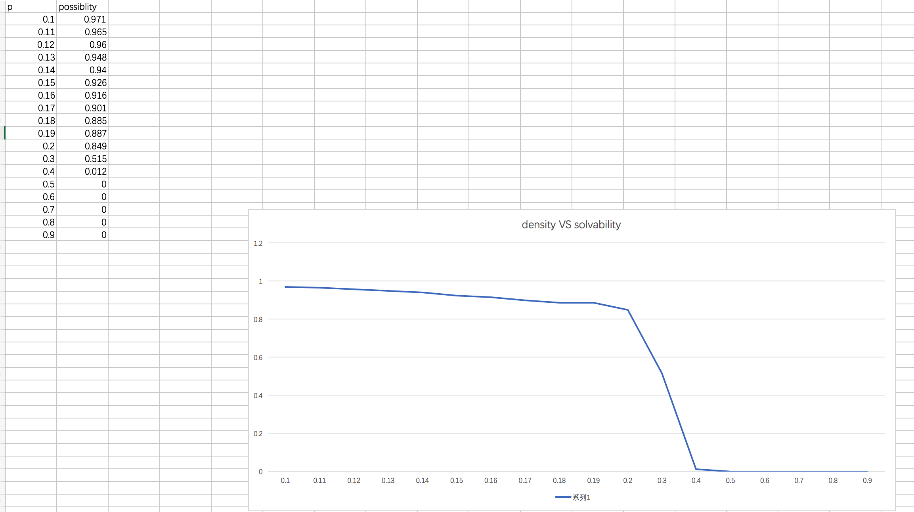

### (4)For p in [0, p0] as above, estimate the average or expected length of the shortest path from start to goal. You may discard unsolvable maps. Plot density vs expected shortest path length. What algorithm is most useful here?
```
Compare 2 different A* algorithm:
```
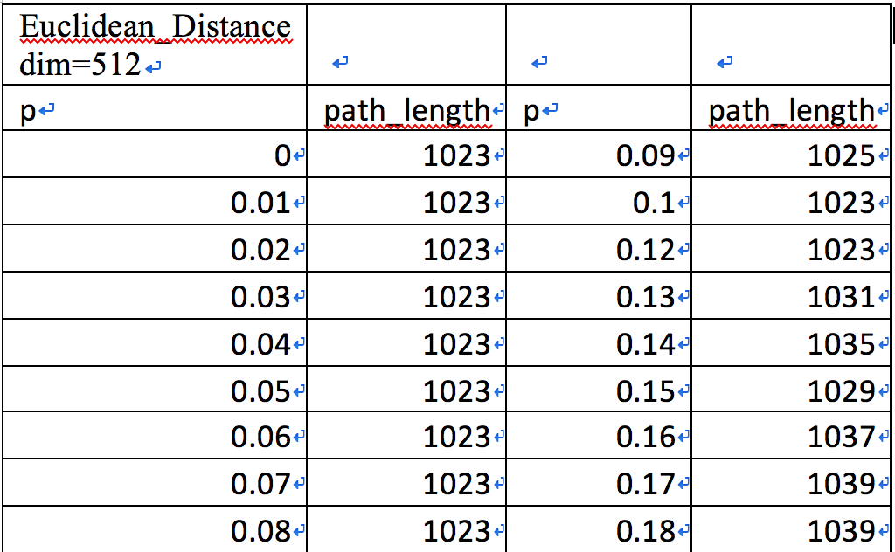
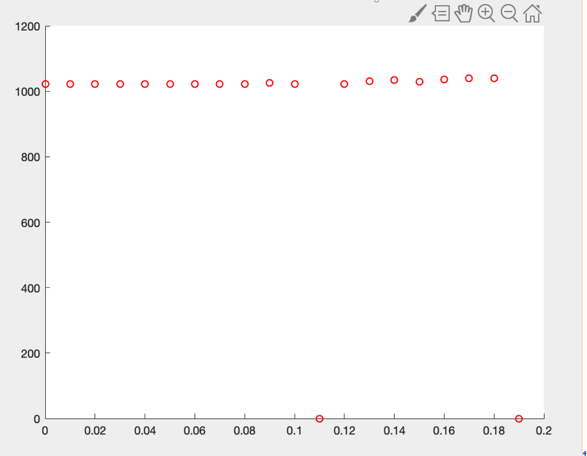

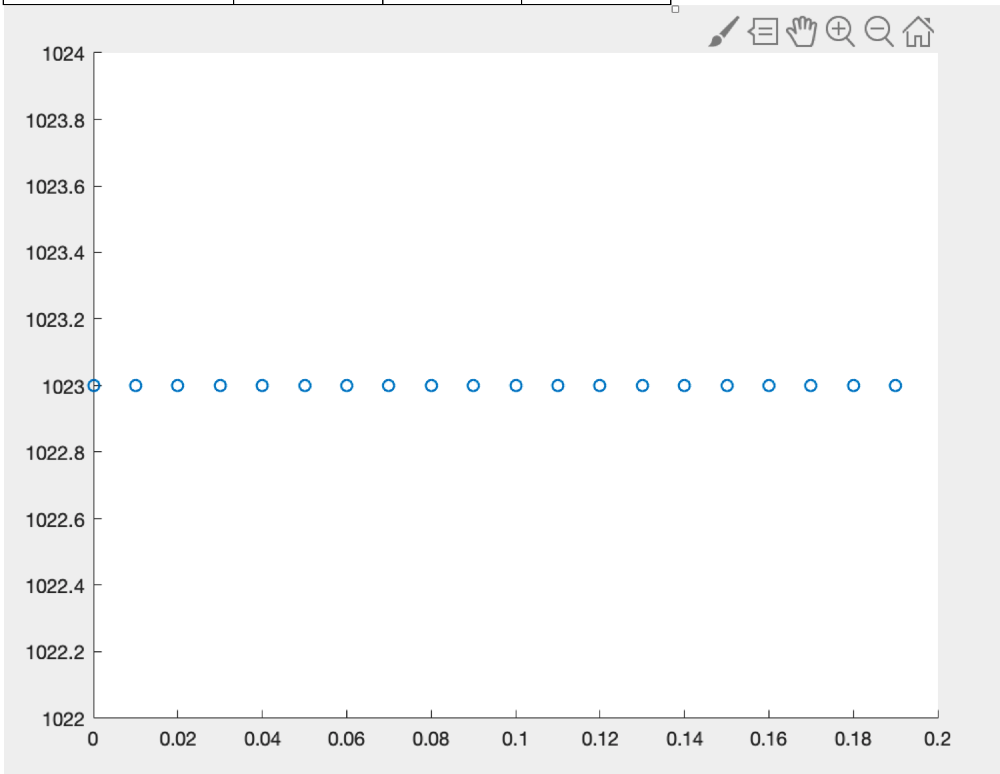
```
Cause Bi_Directional BFS cost lots of time to run dim=512 we use dim=100
```
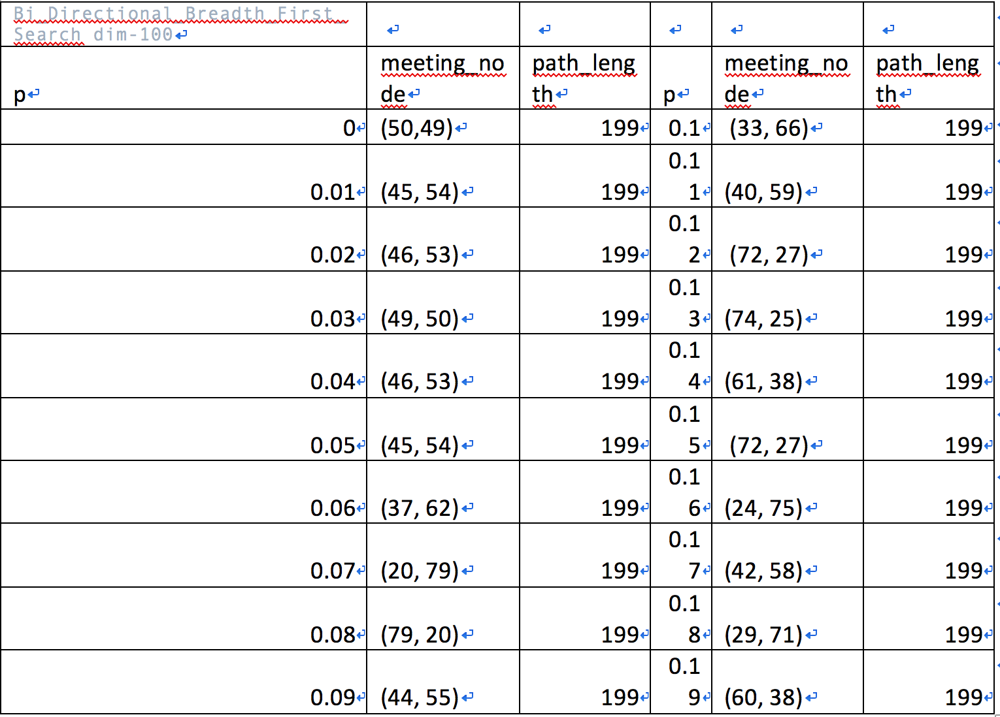
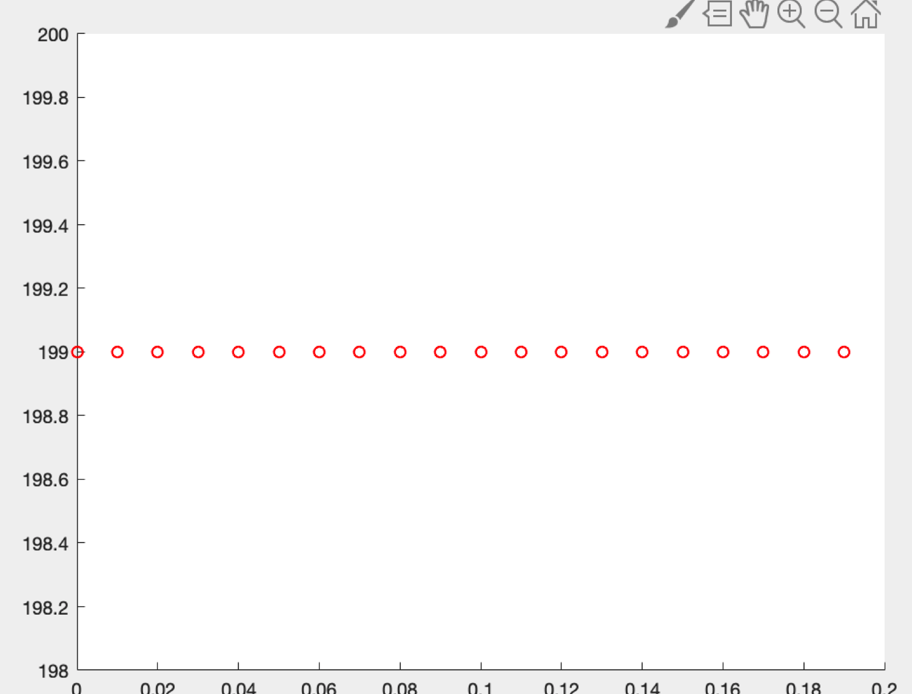

```
Above We can conclude that BiDirectional BFS is time-wasting and A* algorithm perform better
```

### (5) Is one heuristic uniformly better than the other for running A∗? How can they be compared? Plot the relevant data and justify your conclusions.

```
I develop UniformSearch Algorithm, supposing heuristic is 0 and compare with A* algorithm
compare three different algorithm time cost:
set dim=512 and p is ranged from 0 to 0.6 with step 0.05:
total time cost using Manhattan search is 8.99621868133545
total time cost using Euclidean search is 9.80755090713501
total time cost using Uniform search is 11.38677978515625


set dim=512 and p is ranged from 0 to 0.3 with step 0.025:
total time cost using Manhattan search is 12.999441146850586
total time cost using Euclidean search is 12.308625221252441
total time cost using Uniform search is 16.55923104286194

set dim=512 and p is ranged from 0 to 0.2 with step 0.02:
total time cost using Manhattan search is 12.800921201705933
total time cost using Euclidean search is 14.627891063690186
total time cost using Uniform search is 16.26413106918335

Dijkstra is a special case for A* (when the heuristics is zero)
From the data we can conclude that uniformsearch(heuristic uniformly) spend more time than A* algorithm

```
### (6) Do these algorithms behave as they should?
```
Yes BdBFS cost lots of time and A* algorithms perform better
```
### (7) For DFS, can you improve the performance of the algorithm by choosing what order to load the neighboring rooms into the fringe? What neighbors are ‘worth’ looking at before others? Be thorough and justify yourself.

```
Generally, the neighbors which are upwards or leftwards  are more worth looking at, since compared to the neighbors that are leftwards or upwards, since the final path will be more closer to the "center" of the maze, which is similar to Astar's result.

Run Improved_DFS.py and then you can compared the result when dim = 128 and p = 0.2. The only difference between two version is that I rewrite the neighbor() to return the neighbor romms in different order
```


### (8) On the same map, are there ever nodes that BD-DFS expands that A∗ doesn’t? Why or why not? Give an example, and justify.

```
Yes Different algorithm may generate different path and the nodes visited is different.
Using copy.deepcopy library to duplicate 3 same mazes and use 3 algorithms to calculate the sum of visited node 
Here the snapshot of result:
Dim=256 p=0.2 (Here 100 represent path)
Original Path

```
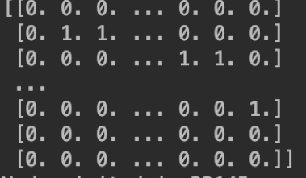
```
For Mahattam A*
```

```
For Euclidean A*
```

```
For Bd-BFS:
```


## Part3

### a)What local search algorithm did you pick, and why? How are you representing the maze/environment to be able to utilize this search algorithm? What design choices did you have to make to make to apply this search algorithm to this problem?
```
Using simulated annealing algorithm, which is better than climbing hill algorithm and we can jump out of the local optimal solution. I think there is no regular to follow so it is not proper to use generic algorithm.

We use ndarray library to represent maze, you can also treat it as 2d list. We can print out the solved maze:0 represent empty 1 represent filled and 100 represent path. We will input a. solvable maze and find the hardest maze using the designed algorithm

Because for different algorithms we need different parameter returned so I wrapped the Astar Manhatan and DFS as classes(we have 2 Astar Manhattan and 2 DFS python files, the files named ended with “class” are applied in part 3 and the others are applied in part 2 and1)
We build our simulated annealing algorithm based on the class notes and modified a little bit to fit our requirement, We mainly use two parameter(get_node_visited,get_path_length) imported by Astar and DFS to get the maximum value using local search algorithm
The input maze size=10 and p=2
For generate random neighbor maze I will still keep the same property (once we remove a wall cell we will break a wall but keep the maze solvable)
```

### b)Unlike the problem of solving the maze, for which the ‘goal’ is well-defined, it is difficult to know if you have constructed the ‘hardest’ maze. What kind of termination conditions can you apply here to generate hard if not the hardest maze? What kind of shortcomings or advantages do you anticipate from your approach?
```
Because I use simulated annealing algorithm so once the temperature cold down and the state is stable, I will return the final result. But how can we measure the stable state?  My algorithm designs a termination condition to value if the value is stable. We will keep record the time the maze enters into stable state. If the temperature cold down and the maze continuously enter into the stable state for 200 times, we will confirm that this is the final result. We can change the threshold, but I think for a maze with dim=10 and p=0.2 which is proper
I think my algorithm’s advantage is I can set the precision threshold for my final result by changing a certain parameter. The outcoming is that I cannot guarantee that the result is the global maximum value each time. I think it is the universal shortcoming for evert local search algorithm

```
### c)Try to find the hardest mazes for the following algorithms using the paired metric: 
### – DFS with Maximal Fringe Size 
### – A∗ -Manhattan with Maximal Nodes Expanded
```
For  Astar Manhhatam(simply run the python file” Simulated_annealing”)
```
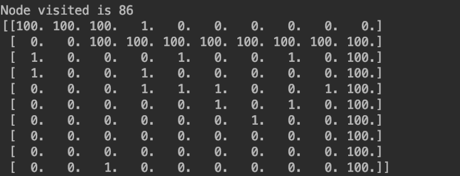
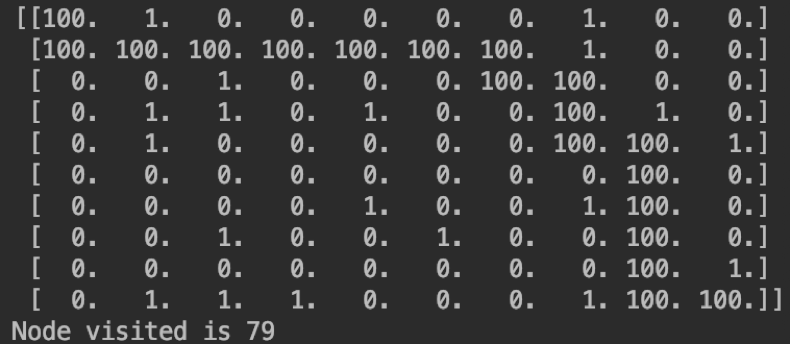
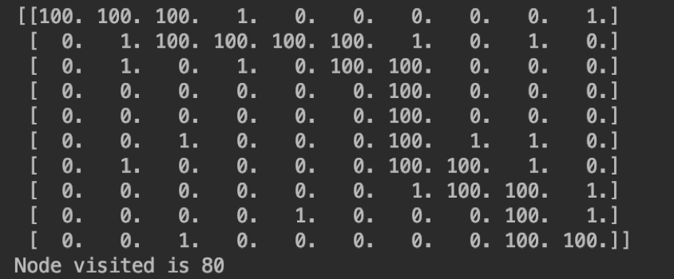
```
For DFS (simply run the python file” Simulated_annealing”)
```
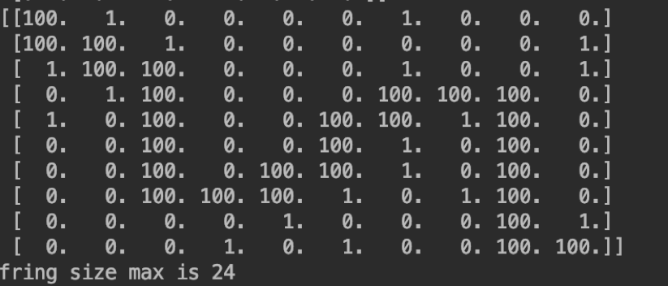
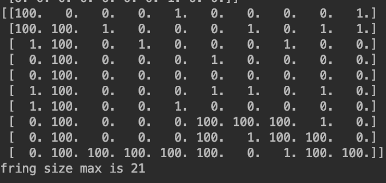
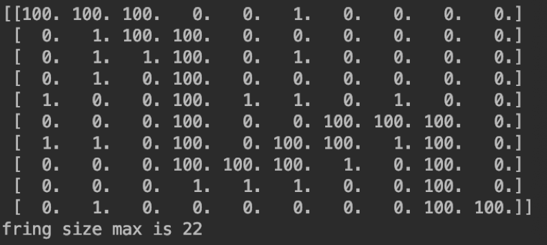

### d)Do your results agree with your intuition?
```
yes, Although there are a little bit different among 3 times running result but we still can get a harder maze
```

## Part4(fire_maze.py)

### a)How can you solve the problem (to move from upper left to lower right, as before) in this situation? As a baseline,
### consider the following strategy: simply find the shortest path in the initial maze, and run it; if you die you die. At
### density p0 as in Section 2, generating mazes with paths from upper left to lower right and upper right to lower left,
### simulate this strategy and plot, as a function of q, the average success rate of this strategy.

```
See class Fire_maze in fire_maze.py. Assume that if the  cell is on fire ,then its value is -1. So first we generate a maze, and set the up-right corner -1, then use search alogrithm test if the fire can spread to the down-left corner.

To simulate the fire spreading conition, in each time step, we will check each fire's neighbors and calulate if these neighbors will get on fire, if the answer is yes then rewrite the values into -1.

Use BFS to find the shortest path, then based on the path's length we simulate the fire spread: in each time step we found the new fire cells and check if any cells are on the shoretest path, if yes then we compare the current time step with the shortest path from start to the fire cell, if the time step is larger than the distance, that means the fire will spread to this cell later than the runner so it's safe to pass through, otherwise this path is unavailabe.

we run the algorithm 1000 times with dim = 64 and p = 0.2
```
q | success rate
:-: | :-:
0 | 1
0.1 | 0.2
0.2 | 0.11
0.3 | 0.08
0.4 | 0.10
0.5 | 0.08
0.6 | 0.10
0.7 | 0.10
0.8 | 0.08
0.9 | 0.08
1.0 | 0.07

### b) Can you do better? How can you formulate this problem in an approachable way? How can you apply the algorithms
### discussed? Build a solution, and compare its average success rate to the above baseline strategy as a function of q.
### Do you think there are better strategies than yours? What would it take to do better? Hint: expand your conception
### of the search space.
```
For each cell n, assume the shortest path from fire to n is d(n), the shortestpath from start to n is f(n), if d(n) > f(n), then it's absolutely safe to pass through n, otherwise it maybe on fire when the runner reach the n.

So my approach is, using the priority queue that the priority = f(n) -d(n), to try to find a path that maybe get on fire but away from the fire source as far as possible. You can see the code in Astar_Improved Class.

This approach is time-consuming so I set the dim = 32, p = 0.2
```
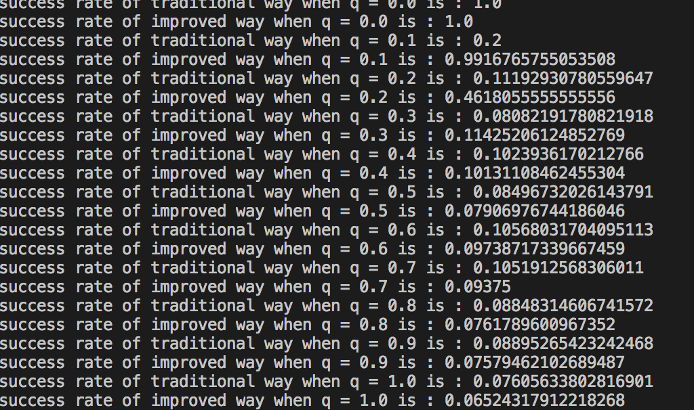
q | traditional way | improved way
:-: | :-: | :-:
0 | 1 | 1
0.1 | 0.2 | 0.99
0.2 | 0.11 | 0.46
0.3 | 0.08 | 0.11
0.4 | 0.10 | 0.10
0.5 | 0.08 | 0.07
0.6 | 0.10 | 0.09
0.7 | 0.10 | 0.93
0.8 | 0.08 | 0.76
0.9 | 0.08 | 0.07
1.0 | 0.07 | 0.06

```
The result shows that our approach is effective when q is smaller than 0.3, while when q> 0.3, our approach nearly has no difference with traditional method.
```