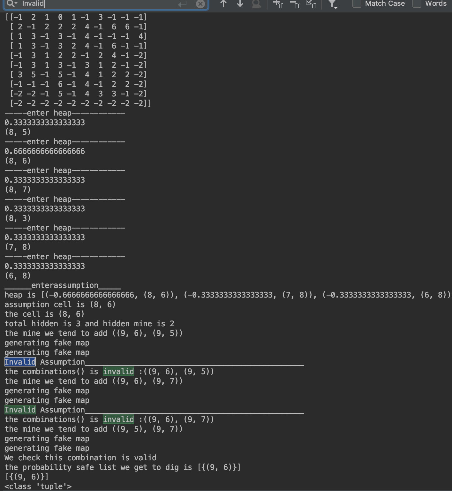
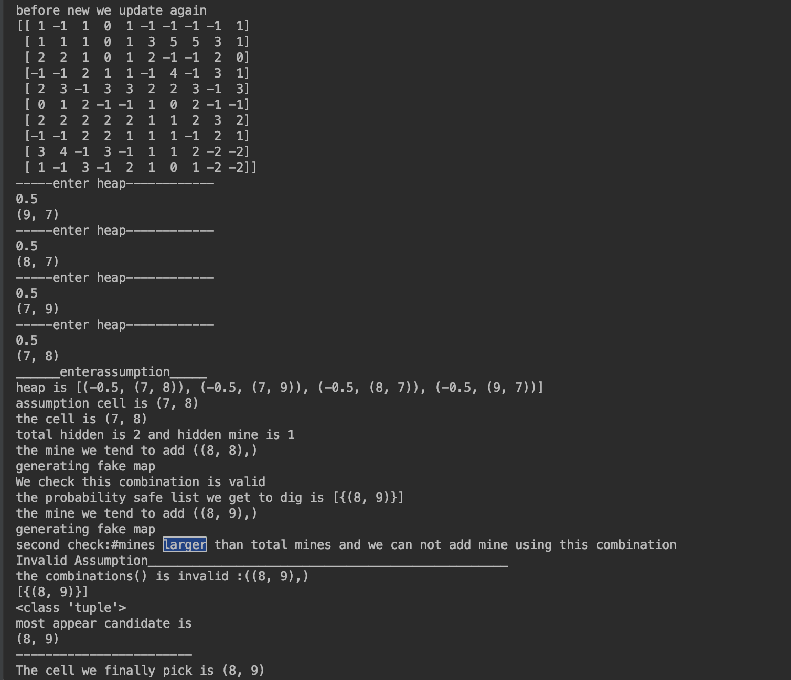
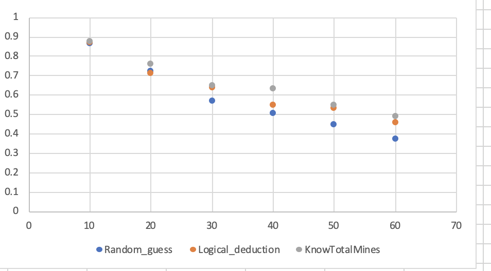

# Assignment2 Writeup

Yusu Weng(yw706) Zhaoxiang Liu(zl355)

## Representation: 

- We use 2D nparray to represent the board
- First of all we will generate a mine map 1=mine 0=no mine 
- When we query the cell, the retrun values are:
  1. Hidden cells=-2
  2. Safe cells >=0  the number represents how many mines around it, also can represent the clue
  3. mines=-1

## Inference:

1. when we collect a new clue we will check if exist a 100% safe cell or a 100% danger cell based on 

>  •If, for a given cell, the total number of mines (the clue) minus the number of revealed mines is the number of hidden neighbors, every hidden neighbor is a mine.
>
>  • If, for a given cell, the total number of safe neighbors (8 - clue) minus the number of revealed safe neighbors is the number of hidden neighbors, every hidden neighbor is safe.

2. Until no more information we can update we will choose to randomly pick one to dig or using the improved algorithm

3. We will refresh our information and clues by updating the map and several datasets like safe set,mine set and hidden set

4. Our program can deduce all possible information based on the aforementioned constraint and satisfaction 

5. we will loop all of the dug cell to make sure no more cells can be deduced

## Decisions:

We have **3 strategies:**

- The basic algorithm is that for a given current state, we will dig all cells which we have 100% confidence it is safe or marking as mine using constraint we mentioned above
- We we encounter the situation that we need to do guess or logical deduction we develop three improved agent
  1. Random move. Shown on *Base Agent.py*
  2. We will select one of the unknown areas around the explored cells. Enumerating all possible combinations and drop the bad cases. Finally, we select an unknown cell which has high possibility to be safe and pick it as the next move. Shown on *Improved Agent.py*
  3. Based on logical deduction, we further implement known-total-mines algorithm. When we make deduction we will drop all cases whose #revealed mines are larger than total mines
- We will show our detail code snippet to illustrate how they work in detail

## Performance/Improvements: 

We know that for minesweeper there are lots of classical cases like picking 1 of 2 or picking 2 of 3

Our alogrithm focuses on efficently handle these cases

### Strategy 2(Logical deduction)

Above situation, we need to pick 1 safe cell out of 3 candidates

We analyze 3 different situations and we exclude 2 cases and conclude the right answer which acts the same as the logical operation

If more than 3 cases we will illustrate the most possible safe cell to pick

##### Strategy 3(Total mines):

We can see that at the bottom right corner because we only have 1 more mine left and we can deduce that the (8,8) is mine and (8,9) is safe cell

I think our program can handle most of the cases that need extra information like total #mines and logical deduction.

## Performance/Comparison: 

We use a 10 by 10 map with mines ranging from 10 to 60

Each algorithm we run for 20 times and plot a scatter plot to compare scores and performance

| (safely identified mines / total mines) (10*10 map average of 20 times measurment | 10    | 20    | 30         | 40      | 50    | 60         |
| ------------------------------------------------------------ | ----- | ----- | ---------- | ------- | ----- | ---------- |
| Random_guess                                                 | 0.93  | 0.775 | 0.665      | 0.605   | 0.52  | 0.47916667 |
| Logical_deduction                                            | 0.945 | 0.885 | 0.76       | 0.67625 | 0.593 | 0.56916667 |
| KnowTotalMines                                               | 0.965 | 0.9   | 0.78666667 | 0.6925  | 0.606 | 0.5725     |

 

When there are few mines in 10 by 10 map 3 algorithms perform almost the same because I think we can hardly step on the mine randomly. We have enough information to deduce and mark all of the mines This time the simple algorithm is better because which can compute well and fast 

When the total number mines increase to 30 we can see that the improved algorithms perform well because the total mines is not too much but enough for us to make deduction. I think when the number of mines between 30 and 40 the minesweeper map is the best map. When doing minesweeper game this proportion is proper and the players have the best user experience. Proper reasoning can improve the accuracy rate

When the total number mines increase to 60. Minesweeper become ‘hard’. Few clues we can utilize and we can frequently meet the mines. We don‘t have too much information to do deduction and mine clearance rate is maintained at 50%

## Improvements:

We've compared 3 different algorithms above and I think only in the final stage of minesweeper. Additional information about total mines is useful because only when there exists a single-digit mine left. We can easily exclude the bad cases. The left hidden mines can act as a extra clue

When there are few mines or too many mines this extra information is useless. We can see that the performance acts the same as without this extra information when we have more than 60 mines in the 100grid map.

### Bonus

we analyze the first model

> When a cell is selected to be uncovered, if the cell is ‘clear’ you only reveal a clue about the surrounding cells with some probability. In this case, the information you receive is accurate, but it is uncertain when you will receive the information.

We modify our algorithms and create 3 extra py files to illustrate this situation in *Possible_generate_no_clue_cell* directory

The basic idea is that if we pick a cell which is safe but return no clues we will skip this one when doing deduction, no matter for 100% confidence or logical inference

Here is the analysis:

We set probability to 0.2, which means we have 20% to get no clue for each safe cell

| propability=0.2 average of 20 times | 10    | 20     | 30         | 40     | 50    | 60         |
| ----------------------------------- | ----- | ------ | ---------- | ------ | ----- | ---------- |
| Random_guess                        | 0.865 | 0.7225 | 0.57166667 | 0.5075 | 0.449 | 0.37583333 |
| Logical_deduction                   | 0.87  | 0.71   | 0.63833333 | 0.5475 | 0.534 | 0.45666667 |
| KnowTotalMines                      | 0.875 | 0.7575 | 0.65       | 0.635  | 0.547 | 0.48916667 |

 

 All scores have dropped a lot because 3 strategies all rely on collecting information to complete the next step. But improved algorithm still perform better because thay alway extract extra information compared with baseline algorithm.When there are few mines 3 algorithms don't reduce their efficiency significantly beacaue the board can still provide enough information for us. But with the number of mines increase, we can easily observe a significant drop down. 

